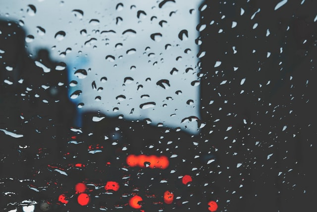

When I lived in Taiwan, I had the opportunity to stay in an apartment in one of the older parts of Taipei. Living in that apartment felt like traveling back in time. Everything there was from the ’80s. I mean everything! I think it even probably smelled as if it did 40 years ago. But I can’t verify that.

The married couple who used to live there have passed away, but the two huge portraits of them in the living room gave me the looks every time I came and left - as if keeping an eye on me.

At times it felt a bit creepy - the feeling you get when you get a sense that you might not be entirely alone. The huge indoor altar didn’t help it either.

The evenings were very quiet. Only the clock made its tik-tok’s. The mornings were super noisy as the market was right there. Quite often, I imagined what life would have been like there 40 years ago—almost every evening.

Even now, I often think of the place and the people that I met: the crowded morning wet markets and night markets. The many late evenings I spent in a Starbucks in Taichung etc. The businessman and his wife I met, some of the girls, old people who came to talk to me in the park as soon as I sat down, etc.

There’s a special word for all this. It’s called nostalgia.

They say nostalgia is when we long for the past. When we yearn for the “good old days”. We usually associate it with a warm feeling. However, I’m not sure if it’s a good thing. At least if there are nostalgic moments very often.

Trying to get back in the past is perhaps even worse than trying to get to the future. Neither of them exists. Past is a present moment that has ceased to exist, and the future is simply an illusion.

Maybe the longing for the past times is a sign that we’re not content with our present situation. But, here’s the thing. Our well-being shouldn’t be dependent on time. There are no “happy times” per se, but how we interpret the current situation for ourselves. The way we see the world is for us to decide.

Of course, I’m not saying that having good memories is not good, but rather that if there’s too much focus going towards the past, then it might be a sign to deal with something in the present instead. Thinking about all the “what could’ve been’s” is not going to do anything good to anyone. One has to move on.

Focus on the present.

Take care and stay inside. I wish you all the best!

https://www.youtube.com/watch?v=B-dwebz2pfw

No more heartache?

K.
