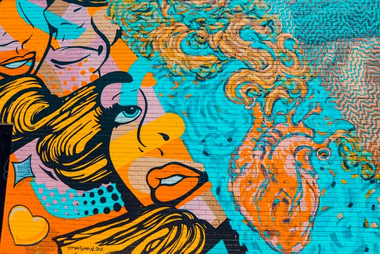

Let's talk about social dynamics.

In every interaction, there's the person who's setting the rhythm while the other is reacting. Usually, the person who's talking is the one making others react (but not necessarily).

Imagine one person being the oak tree and the other the squirrel. The squirrel is the one running around the oak tree while the tree is just standing still, unaffected by the running of the squirrel. The squirrel is reacting to the tree. This is the same for human interactions.

But what is this "reacting" anyway?

Being in reaction means being affected by the words or action/inaction of the other person. In other words, it's being at the effect and not at the cause.

So, it's also possible not to do the talking and have the other person be in reaction instead. E.g., if someone would yell at you while you remain cool and calmly look into their eyes - that would mean that they're the ones in reaction.

In a sense, it's about being in control. There's always someone whose frame is stronger, and a stronger frame will eat the weaker ones. It's not something negative or bad; it's just how it works.

K.
