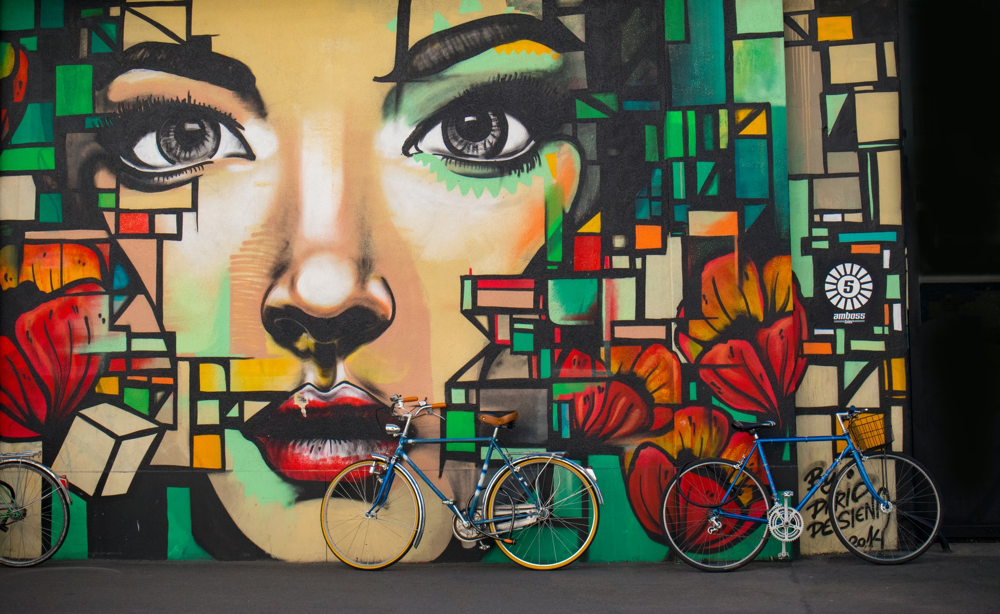

I thought about giving you - my dear friend and reader - a small update regarding this blog. 

**First**, if you wonder about the new minimalistic look, it's because I migrated my site from Wordpress platform to Gatsby and now host it on Netlify. This means that I had to export all my old posts and convert them from an XML format into Markdown files - which, as you can see, was more or less successful.

Why the migration? A couple of reasons. 

I like to tweak around and find ways to improve the old. Wordpress is slow. And its technology is becoming more and more obsolete (my opinion). With Gatsby/Netlify combination, I can host my site for free, write my blog posts in Markdown file format, and push them to Github. Netlify will take care of the rest. In other words, I can publish my posts from the big scary black box (the terminal/command line), which is super cool for a geek like me.

However, the side-effect of this migration was that the (file paths of) images and photos of my old posts are now broken. Maybe I'll fix it. Maybe I won't. Either way, this is not a priority at the moment. Besides, more often than not, it's a good idea to leave the old behind and keep on moving forward. 

> Stability lies in change, not in stagnation.

**Secondly**, I haven't taken any pictures for almost a year. It's not because I don't care about photography anymore - it's because I have to give it up to pursue something else. Even though we can have almost anything we want, unfortunately, we can't have everything. As the Russian proverb says: 

> "By chasing two rabbits, he catches neither."

And like Santiago in The Alchemist, so do I have to make my sacrifices. To follow our dreams, we have to leave something else behind. Even if it's the things, we love.

More to come.

K.
