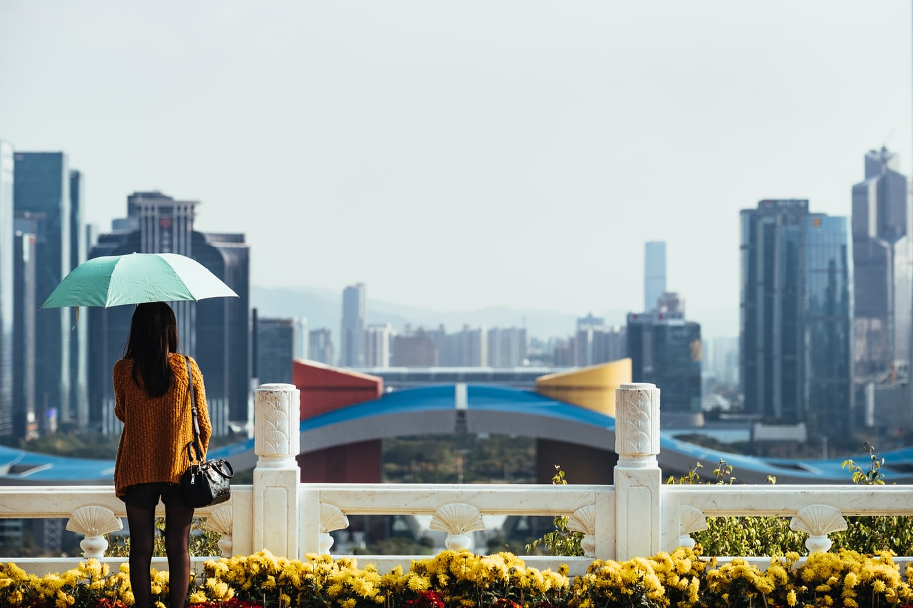

I thought I'd share with my readers something slightly different. As some of you might know, books are super important to me. Since I started reading books, my life started to change to the better - and it continues to do so.

The reason is simple. If you read great books, it will influence your thinking. It's as if you're constantly around great and successful people. In a sense, I think it is.

I don't think our brain makes a huge difference whether you hang out with Grant Cardone in real life or you're just hearing him narrate one of his books on your headphones.

Great books - and great people - influence our thinking and world-view, which in turn influences our actions. Our mind goes first and the body follows. It's just like when working out - it's in your mind where you make the decision to push for another rep and your body has no other choice but to follow.

A while ago, [I wrote about my favorite books](https://www.kristjanvingel.com/2019/2019-10-30-top-insights-ive-learned-about-reading-books/). Since then I've found some more great books, that I'd consider a must-read. Here is another top 10 - in no particular order.

1. **Be Obsessed or Be Average by Grant Cardone**

This is the best Cardone book I've read. Sell or Be Sold and The 10X Rule are also great, but this is something I definitely need to read again.

2. **Can't Hurt Me by David Goggins**

This books will turn your idea of a "limit" upside down. If you think you can't any more - you're really just on 40%. He shows that so much is just behind our mindset, not our actual abilities. Stories such as him running 100 miles on broken legs, really make you second-guess your beliefs about certain decisions you've made in life.

3. **Extreme Ownership by Jocko Willink and Leif Babin**

Another great book. If you're interested in the Navy Seals operations in Afghanistan or want to stop complaining about the petty things in life - or want to know how great leaders think, you can't go wrong with this.

4. **Sell or Be Sold by Grant Cardone**

Grant Cardone is a master in sales. He's been in this business for a very long time and definitely knows this thing more than almost anyone else. Whatever you do in life, you can't get past selling. You could have the best idea or product in the world, flawless marketing, but if you don't sell, none of it matters.

5. **The Female Brain by Louann Brizendine**

So, why are women from Venus and men from Mars? This book provides a great insight into the mind of a woman. In my opinion, you can't go wrong with any books that make you understand people better. This is one of those books.

6. **The Millionaire Fastlane by M. J. DeMarco**

This book will show you how rich people actually got rich. Hint: it's not saving up on Latte's or investing in mutual funds. I will definitely read this book again as it provides a ton of value.

7. **Total Recall by Arnold Schwarzenegger**

This is truly an awesome read and adventure. Again, you get to peek into the mindset of a very successful person. How did an Austrian from a small cow-town become the most muscular man in the world, a famous movie star and a Governor of California? It was clearly because he was lucky ;)

8. **Disrupt You by Jay Samit**

I finished this just a few days ago - right after reading Total Recall. It provides great insight into businesses and startups.

There's a great scene in Raiders of the Lost Ark, where Indiana Jones is challenged by a master swordsman into a sword duel. Instead of participating in this, Jones simply pulls out his gun and shoots the swordsman dead. That's disruption!

This is also how many startups disrupt existing businesses. E.g. Uber vs the taxi industry, Spotify vs Album CD's, Wikipedia vs Book encyclopedias etc.

But it's not only applicable to huge corporations - it's very much relevant to a single person. You'll learn how to disrupt yourself and your old ways of thinking.

9. **Letting Go by David R. Hawkins**

A quite controversial book and author (just google it). Sure, there's some bullshit in it, but there's also a lot of golden nuggets. Does the bs make the good disappear? No, just ignore the parts you don't relate to and take in the parts you like.

10. **The Alchemist by Paulo Coelho**

This is the only fiction book on the list but it has definitely changed my thinking. It talks about dreams, sacrifices and omens. It's an epic adventure with an awesome ending.

Runner up: **The Fear Bubble by Ant Middleton**. How does it feel like it to climb the Everest with little preparation and nearly die? Reading this book, I could almost feel the freezing sharp wind of the Everest and the struggle. It's a quick and easy read, definitely recommend!

So, there you go. I hope you enjoyed this article, and see you until next time!

K.
