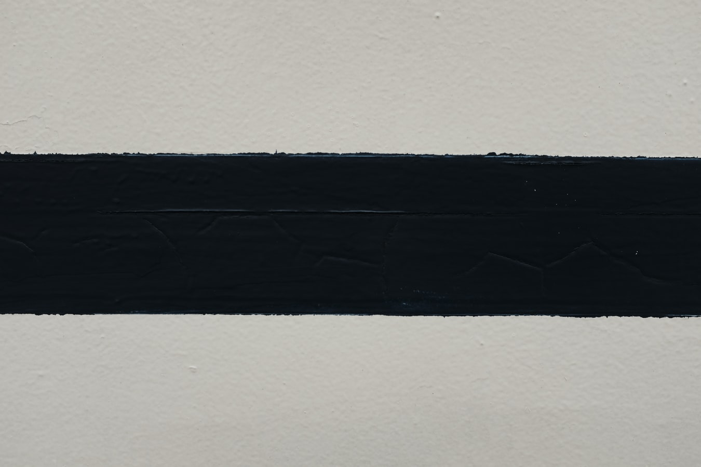

First, I want to stress that even though I believe this to be a universal principle, it's still my opinion and might not work for everyone. People are different after all. The key is to find out what works for you and then just use that.

The principle is simple. Cut out everything you can from your life that does not at least undirectly help with your goal. You want to put as much focus as possible on your goal and avoid any distractions. Essentially, your life would now evolve around your goal. You think, eat, sleep, dream, and talk about your work.

By the way, by "work" I don't mean your "job". Your work is something a lot higher - it's your purpose, your art, your calling - whatever it is to you. It's different for everyone.

Your work will be at the center of your attention. Everything else that's unrelated has to go.

Karl Jung spent weeks alone in a cabin cutting off any social life so that he could focus only on his work. He wasn't famous at the time and going against Freud's ideas meant that he couldn't just throw out some half-assed work. He had to put everything he got into his work.

This will be temporary. It doesn't mean you have to move to the cave for the rest of your life. When Jung was done with his work, he went back to Vienna's exciting social life and enjoyed that to the fullest.

The point is to do one thing at a time. You can't have fun and produce great work at the same time. Rather, it's better to spend at least a few weeks doing only your work, and party and socialize or whatever you want to do after that.

Whenever I've broken this principle, everything falls apart.

By trying to do this and that and then another thing, I end up doing nothing. It's because my mind is elsewhere. My mind is all over the place as there are too many things to think about. Yet, if I only think about a couple of things, it's easier.

Now, obviously, we can't cut out everything. That's not even necessary. The point is to cut out everything we can cut out. Your world is not going to fall apart if you don't hang out with your friends for a while. They're not going to stop being your friends if you "disappear" for few months.

Do an audit of your activities. What can you cut out? What are the things that benefit and what do not benefit your pursuit of achieving your goal? What would happen if you cut out x from your life?

Take a view of a third person. Tweak yourself as if it's a machine. Make it as efficient as possible. Remove the bottlenecks and "add oil" where necessary.

K.
