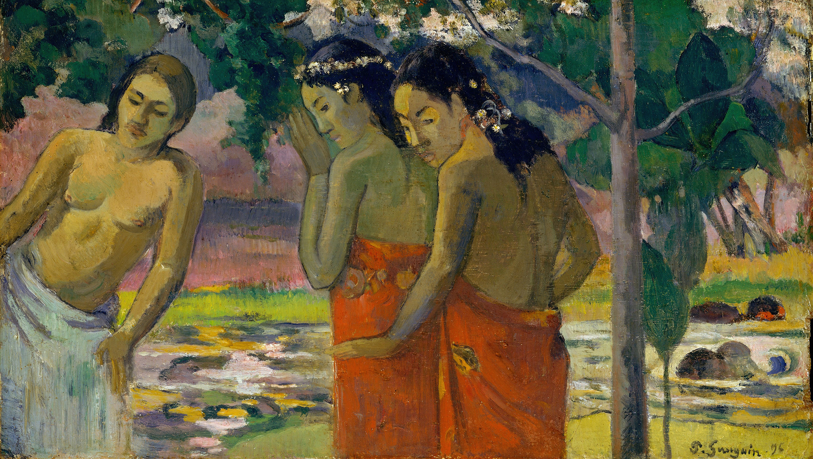

If you pay close attention, you can recognize these types of guys easily.

They're not necessarily wearing shining armor and riding a horse, but their need to 'save' women is so apparent and obvious that if you know how to look, you possibly can't miss them.

So, these are the kind of men who buy into the fairytales and general stories of knights who are the epitome of higher moral standards, go slay an evil dragon holding the princess hostage and marry her in the end.

Where do these stories come from? Real-life stuff turned into symbols is my guess.

These guys don't understand that those women he wants to save don't want to be saved. Women can stand for themselves just fine, so there's no need for a savior - especially when they never asked for one.

In the spirit of fairytales, the dragon can then be of some player guy or a fuckboy that "bothers" a girl. And of course, after the dragon is eliminated, the nice guy white knight now has some expectations.

They're doing all this while having an agenda themselves. They're just hiding it.

What's the agenda? Well, they want the woman for themselves, of course. That is their strategy to get "bonus" points in front of the princess.

A white knight can also appear more subtly.

The other day I was reading a newspaper article from a man who was saying in his article that - and let me paraphrase it:

"The life in times of crisis is public violence against women who are subject to disproportionate burden in bringing society out of the crisis. Women will not be properly thanked... this is a common weapon in the hypocritical behavior of male-centered political world... ."

There you go - a white knight on his quest.

As I said before, I think women are perfectly able to stand for themselves. And in general, nobody wants to be saved. People want to achieve stuff themselves.

If you try to help someone who's struggling and take their struggle away from them, they're going to secretly despise you. They feel they didn't achieve it themselves, and that makes them feel stupid and helpless. They'll hate you for making them feel like this. Trust me.

Don't 'help' people unless you know they actually appreciate your help, e.g., if they ask for it.

Just like the J Cole sings in "No Role Modelz": "She doesn't want to be saved, don't save her."

K.