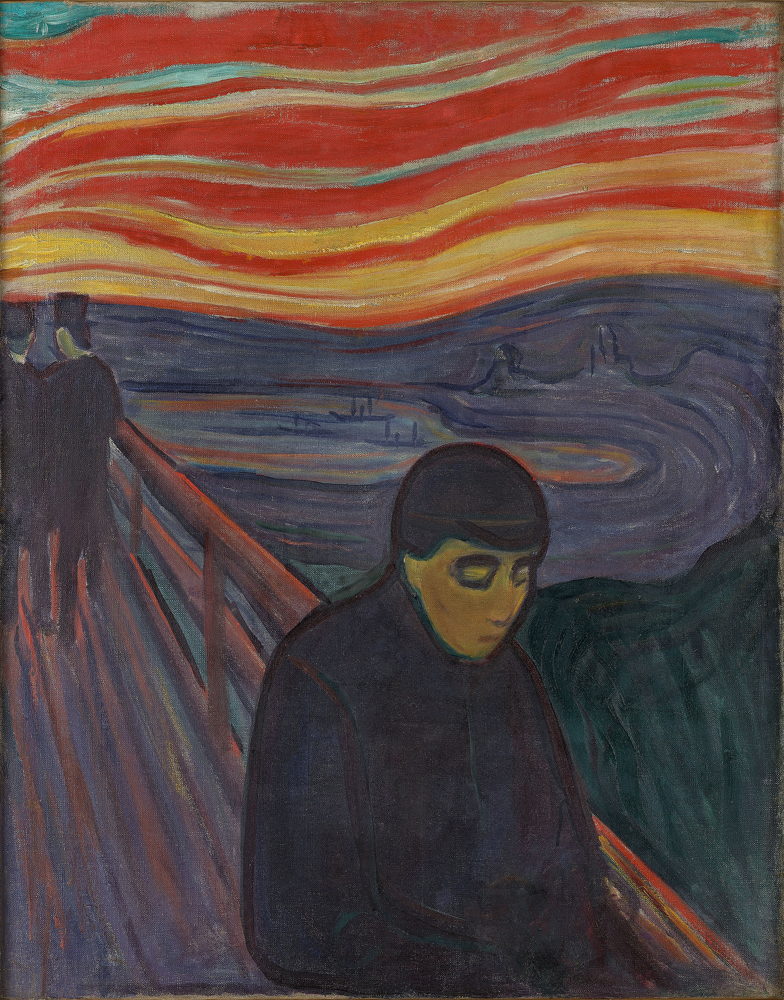

Political correctness.

Also known as one of the most toxic diseases of the modern world.

Politically correct people are like cancer that sucks all the living soul out of everyone surrounding them. They're like the 'dementors' in Harry Potter. It's best to keep your distance.

PC is the opposite of fun. It's the opposite of being free in your expression. It's suffocating and cold.

If you're politically correct, you're just boring people to death, nothing more. Stop this immediately.

PC makes people filter absolutely everything they say or do. "Maybe it offends someone? Maybe someone doesn't like it? I better not say it". Filtering means to dumb down everything interesting about you.

The result? Absolutely nothing fascinating. Pure flatness and sameness.

When I first heard about the concept of "filtering," I realized that I was doing this unconsciously in my interactions all the time. I immediately began to practice getting rid of these filters and just saying whatever I want to say.

If I offend anyone, awesome - it just means we're not compatible, and I'm glad I found that out sooner rather than later. It's normal, and I wish these people the best in their life, and we depart ways.

Life's too short to spend it with people you have no fit with. If you can't express yourself freely, whats' the point?

And it's quite clear that the problem lies within the PC people, not within the people making fun of someone or some group. How do I know this? Just look at the eyes, man. They are the best indicator of a person's well-being.

On one side people are happy, having fun, their eyes are bright and clear. They're 'free' and 'alive.' The other side? Well...

It's as if they're dead inside. In fact, I often ponder whether we're even dealing with real people. Maybe they're aliens or computer programs running their script as they go on about their routine. Who knows.

Does this mean to run around and say the most polarizing and vulgar things you can think of? No, of course not. That would just make you look autistic or someone with low social intelligence.

It's also not about deliberately offending people. That's what immature assholes do.

Instead, the point is not to filter your ideas or expressiveness or sense of humor to accommodate someone else's worldview.

Be fun, be carefree, and engaging. Say what you want to say. If someone doesn't like your humor, don't associate with them - I can assure you there are people who relate to you. But if you filter yourself, you'll never find them. People are not psychic to know what you think or like. You have to show them.

Stay home, stay safe and see you in the next one,
K.
