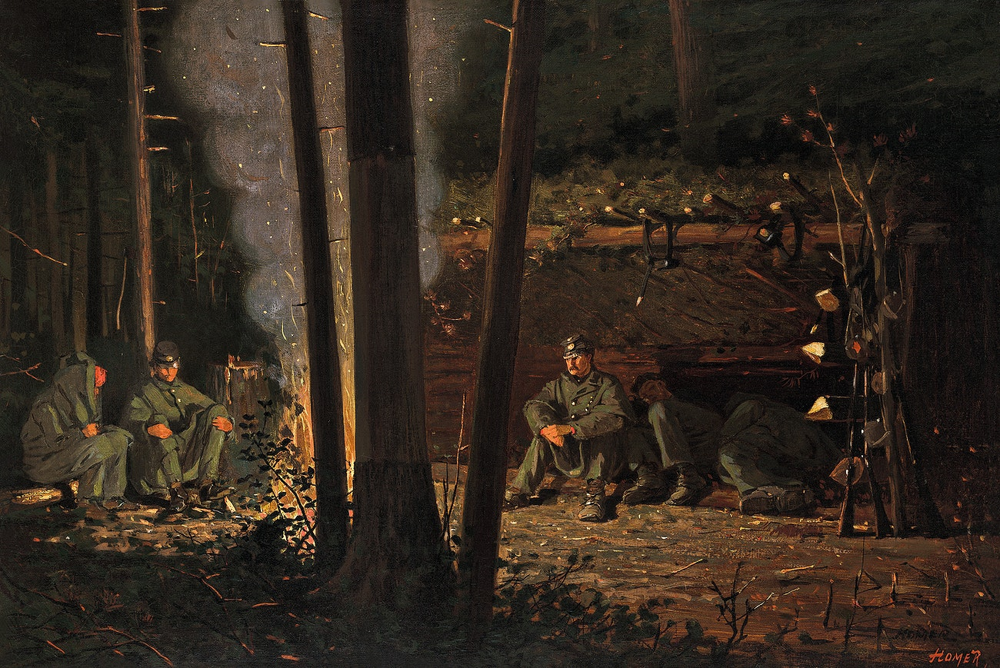

A while ago, I wrote that the best workout app is the Centr app. I think it was about a year ago. I've been using it almost every day ever since and intend to continue using it until I die (or until I find something even better).

The result is that I'm more fit than anyone I know. In fact, I rarely see someone close to or above my level of fitness.

But enough of my borderline narcissistic rant.

Jokes aside, today I want to share an app for the mind instead. It's called Endel, and it's precisely the kind of app I wish I would've made.

Yet, machine learning, AI and all that complex technology powering it are unfortunately way beyond my capabilities. Endel's resources are vast. It's backed by investors, scientists, great software engineers, and so on. So I'd never be able to code up anything remotely like this. Still, I sometimes daydream that I could...

Basically, this app generates music - for whatever purpose you want. You put on your headphones and let it work your mind. That's it.

I only use it for tasks that require deep work, but there are programs for sleep, relaxation, and some other stuff I don't care about. I think that their (recently introduced) techno sound for focusing is better than anything else I've encountered on the market - and believe me I've been on a quest for good sounds for mental tasks a while.

Some people are against apps like these.

My opinion is that - if it helps you, then use it. Use whatever little thing you can that improves you or your capabilities - even if just 0.5%. If you've read the future classic Atomic Habits by James Clear, then you'll know what I mean (hint: the British cycling team).

As a side note - if you haven't read that book, read it! It's one of those fundamental books that are important if you care about self-improvement. It's on the same level as "The Power of Now" by Eckhart Tolle, "The War of Art" by Steven Pressfield, "The One Thing" by Gary Keller, or "Mindset" by Carol Dweck - to name a few. It's not just any random self-help book.

K.
